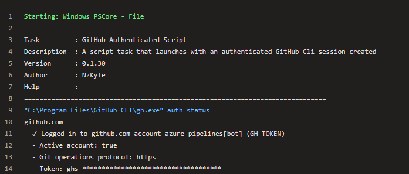

# GitHub Authenticated Script Task

A script task that take a [GitHub Service Connection](https://learn.microsoft.com/en-us/azure/devops/pipelines/library/service-endpoints?view=azure-devops#github-service-connection) name as a parameter and sets the GH_TOKEN environment variable to the value of the token associated with that service connection. 

This allows you to use the [gh cli app](https://cli.github.com/manual/gh) within your pipeline without needing to worrying about storing a [PAT](https://docs.github.com/en/authentication/keeping-your-account-and-data-secure/managing-your-personal-access-tokens) in a pipeline variable.  

**_NOTE: The GH_TOKEN environment variable is only set within the scope of this task and isn't available once the task completes_**

This task is based heavily on Microsoft's [AzureCLI@2 task](https://learn.microsoft.com/en-us/azure/devops/pipelines/tasks/reference/azure-cli-v2?view=azure-pipelines). 

## Syntax

```yaml
# GitHub Authenticated Script v1
# Run Azure CLI commands against an Azure subscription in a PowerShell Core/Shell script when running on Linux agent or PowerShell/PowerShell Core/Batch script when running on Windows agent.
- task: GitHubAuthenticatedScript@0
  inputs:
    gitHubServiceConnection: #string GitHub Service Connection name. 
    scriptType: # 'ps' | 'pscore' | 'batch' | 'bash'. Required. Script Type. 
    scriptLocation: 'scriptPath' # 'inlineScript' | 'scriptPath'. Required. Script Location. Default: scriptPath.
    scriptPath: # string. Required when scriptLocation = scriptPath. Script Path. 
    #inlineScript: # string. Required when scriptLocation = inlineScript. Inline Script. 
    #arguments: # string. Alias: scriptArguments. Script Arguments. 
    #powerShellErrorActionPreference: 'stop' # 'stop' | 'continue' | 'silentlyContinue'. Optional. Use when scriptType = ps || scriptType = pscore. ErrorActionPreference. Default: stop.
  # Advanced
    #workingDirectory: # string. Alias: cwd. Working Directory. 
    #failOnStandardError: true # boolean. Fail on Standard Error. Default: true.
    #powerShellIgnoreLASTEXITCODE: false # boolean. Optional. Use when scriptType = ps || scriptType = pscore. Ignore $LASTEXITCODE. Default: false.
```

## Example

```yaml
- task: GitHubAuthenticatedScript@0
  displayName: "PSCore - Inline"
  inputs:
    gitHubServiceConnection: temp
    scriptType: pscore
    scriptLocation: inlineScript
    inlineScript: |
      gh pr list
```

```yaml
- task: GitHubAuthenticatedScript@0
  displayName: "PSCore - File"
  inputs:
    gitHubServiceConnection: temp
    scriptType: pscore
    scriptLocation: scriptPath
    scriptPath: test.ps1    
```
The task will run a `gh auth status` once the `GH_TOKEN` environment variable is set - and you will see log output similar to this:

